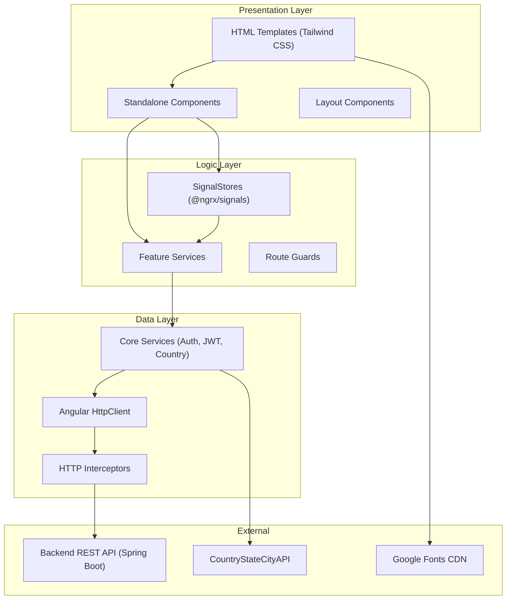
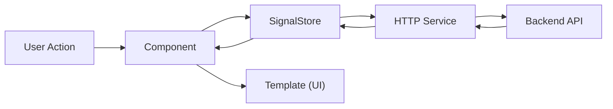
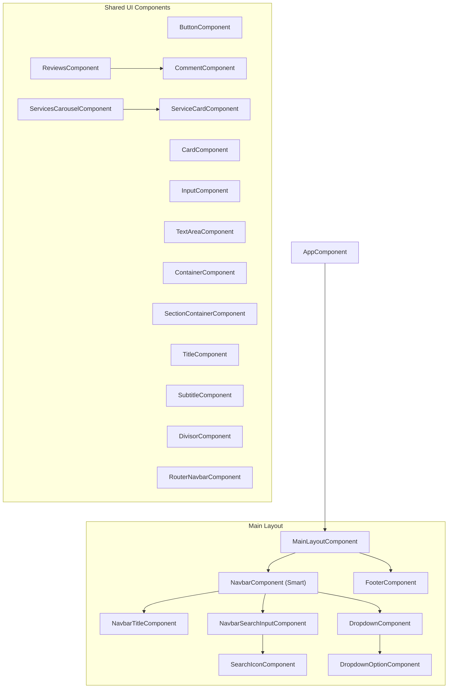
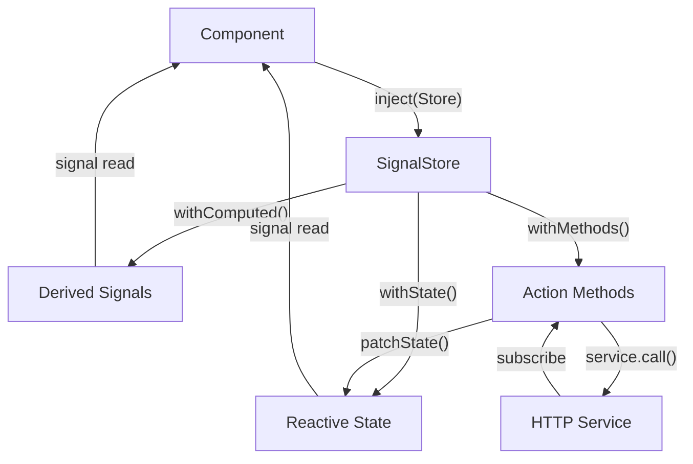
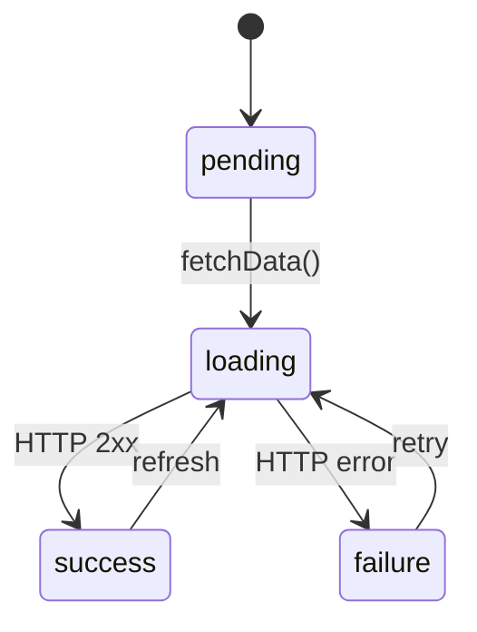
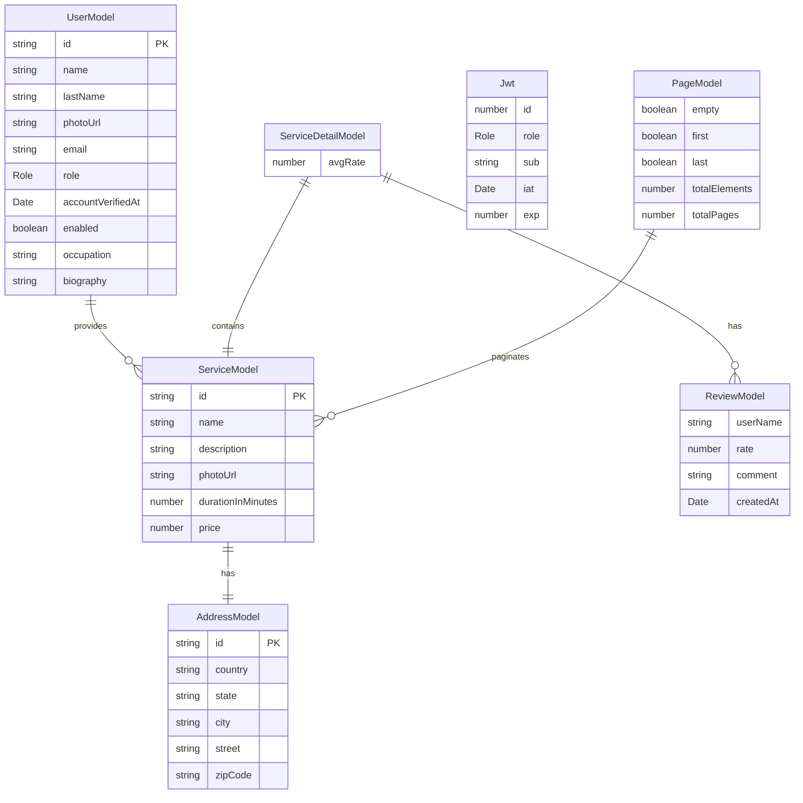
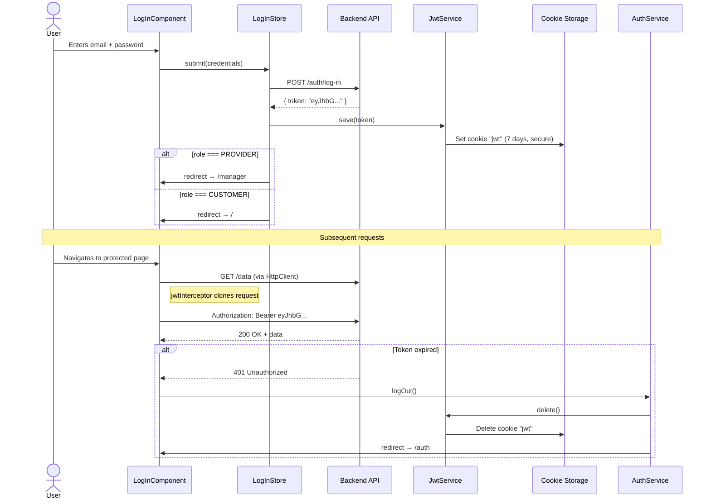

# Design Document — BookNow Client

Design, architecture, and technical decisions documentation for the BookNow frontend.

---

## 1. Product Vision

**BookNow** is a professional services marketplace that connects providers with clients. The frontend enables:

- **Discovery**: Search for services by keywords, explore providers, and read reviews.
- **Bookings**: Schedule appointments by selecting date and time directly from the service detail page.
- **Management**: Providers manage their services, appointments, and profile from a dedicated portal.
- **Authentication**: JWT-based registration/login system with differentiated roles (CUSTOMER / PROVIDER).

---

## 2. High-Level Architecture

### 2.1 Layer Diagram



### 2.2 Architectural Pattern: Feature-Based + Layered

The application follows a hybrid architecture:

1. **Feature-Based**: Each functionality (`auth`, `search`, `service`, `settings`, etc.) is a self-contained module with its own components, services, stores, and routes.
2. **Layered**: Within each feature and at the global level, separation is maintained across:
   - **UI Layer** (`components/`, `layouts/`) — Rendering and presentation.
   - **Logic Layer** (`stores/`, feature services) — State and business logic.
   - **Data Layer** (`core/services/`, `interceptors/`) — Communication with external APIs.

### 2.3 Unidirectional Data Flow



---

## 3. Component Architecture

### 3.1 Component Hierarchy



### 3.2 Reusable Component Catalog

| Component                   | Selector                | Type           | Purpose                                                                             |
| :-------------------------- | :---------------------- | :------------- | :---------------------------------------------------------------------------------- |
| `ButtonComponent`           | `app-button`            | Polymorphic    | Renders `<a>` (with `routerLink`) or `<button>` depending on whether it has `route` |
| `CardComponent`             | `app-card`              | Container      | Wrapper with border, padding, and soft shadow (`white` or `dark` theme)             |
| `InputComponent`            | `app-input`             | Form Control   | HTML input bound to a `FormControl` with label and validation                       |
| `TextAreaComponent`         | `app-text-area`         | Form Control   | Textarea with auto-resize bound to `FormControl`                                    |
| `ContainerComponent`        | `app-container`         | Layout         | Centered wrapper with `max-w-4xl`, optional headline and description                |
| `SectionContainerComponent` | `app-section-container` | Layout         | Section with subtitle and content projection                                        |
| `TitleComponent`            | `app-title`             | Typography     | Styled `<h2>` with configurable alignment                                           |
| `SubtitleComponent`         | `app-subtitle`          | Typography     | Styled `<h3>`                                                                       |
| `DivisorComponent`          | `app-divisor`           | Visual         | `<hr>` with `border-gray-200` style                                                 |
| `FooterComponent`           | `app-footer`            | Layout         | Global footer with copyright and legal links                                        |
| `ServiceCardComponent`      | `app-service-card`      | Presentational | Service card with image, name, rating, and link                                     |
| `ServicesCarouselComponent` | `app-services-carousel` | Container      | Horizontal scroll of `ServiceCard` items                                            |
| `ReviewsComponent`          | `app-reviews`           | Composite      | Reviews section with average and comment list                                       |
| `CommentComponent`          | `app-comment`           | Presentational | Individual review with avatar, stars, and text                                      |
| `RouterNavbarComponent`     | `app-router-navbar`     | Navigation     | Tab-style bar for sub-navigation with `routerLinkActive`                            |

### 3.3 Smart vs Dumb Component Pattern

| Aspect               | Smart (Container)                                        | Dumb (Presentational)                                                |
| :------------------- | :------------------------------------------------------- | :------------------------------------------------------------------- |
| **Responsibilities** | Manages state, injects services, coordinates the view    | Receives data via `input()`, emits events via `output()`             |
| **Examples**         | `NavbarComponent`, `SearchComponent`, `ServiceComponent` | `ResultCardComponent`, `DropdownOptionComponent`, `CommentComponent` |
| **Stores/Services**  | Yes, injects stores and services                         | No external dependencies                                             |
| **State**            | Manages local state signals                              | No own state (or minimal)                                            |

---

## 4. Routing System

### 4.1 Complete Route Map

```
/ ─────────────────────────────────────────────────────────────────
│
├── '' ──────────────────> MainLayoutComponent (Shell)
│   ├── ''               → HomeComponent
│   ├── 'appointments'   → AppointmentsFeature (lazy)
│   ├── 'search'         → SearchComponent (?keywords=...)
│   ├── 'service/:id'    → ServiceFeature (lazy)
│   │   ├── ''           → ServiceComponent (detail)
│   │   └── 'appointment'→ AppointmentComponent (booking)
│   ├── 'provider/:id'   → ProviderComponent
│   └── 'settings'       → SettingsFeature (lazy) // canActivate: [AccountGuard] (pending)
│       ├── ''           → redirect → 'profile'
│       ├── 'profile'    → ProfileComponent
│       └── 'security'   → SecurityComponent
│
├── 'auth' ──────────────> AuthFeature (lazy, own layout)
│   ├── ''               → redirect → 'log-in'
│   ├── 'log-in'         → LogInComponent
│   ├── 'sign-up'        → SignUpComponent
│   └── 'successful-registration' → SuccessfulRegistrationComponent
│
├── 'manager' ────────────> ManagerFeature (lazy) // canActivate: [AccountGuard] (pending)
│
└── 'sign-out' ───────────> SignOutComponent (lazy)
```

### 4.2 Loading Strategies

| Strategy                      | Usage                                    | Example                                         |
| :---------------------------- | :--------------------------------------- | :---------------------------------------------- |
| `loadComponent`               | Routes with a single component           | `search`, `provider/:id`, `sign-out`            |
| `loadChildren`                | Routes with their own sub-routes         | `auth`, `settings`, `service/:id`, `manager`    |
| `withComponentInputBinding()` | Bind route params to component `input()` | `service/:id` → `readonly id = input<string>()` |

### 4.3 Guards (Current State)

> **⚠️ Pending implementation**: `AccountGuard` is referenced but commented out in routes for `manager` and `settings`. Protected routes currently have no client-side protection.

---

## 5. State Management

### 5.1 Architecture with @ngrx/signals

The project uses **SignalStore** from `@ngrx/signals` as the state solution. Unlike the classic NgRx Store (actions + reducers + effects + selectors), SignalStore offers a more compact API directly integrated with Angular Signals.



### 5.2 Per-Feature Store Pattern

Each feature that requires complex state defines its own store:

| Store          | Feature        | State                                 |
| :------------- | :------------- | :------------------------------------ |
| `LogInStore`   | `auth/log-in`  | `status`, credentials, error          |
| `SignUpStore`  | `auth/sign-up` | `status`, registration data, error    |
| `ServiceStore` | `service`      | `status`, `ServiceDetailModel`, error |

### 5.3 `Status` Type (State Machine)

```typescript
type Status = "pending" | "loading" | "success" | "failure";
```



---

## 6. Data Model

### 6.1 Entity Diagram



### 6.2 Base Model: `ResponseModel`

All persisted entities inherit audit fields:

```typescript
interface ResponseModel {
  createdBy: string;
  updatedBy: string;
  createdAt: Date;
  updatedAt: Date;
  deletedAt: Date; // Soft delete
}
```

### 6.3 `Role` Enum

```typescript
enum Role {
  CUSTOMER = "CUSTOMER",
  PROVIDER = "PROVIDER",
}
```

---

## 7. Authentication and Security

### 7.1 Authentication Flow



### 7.2 Security Components

| Component                     | Responsibility                                                 |
| :---------------------------- | :------------------------------------------------------------- |
| `JwtService`                  | JWT token CRUD in cookies (save, get, decode, delete)          |
| `AuthService`                 | Session state (`isLogged`, `isProvider`), logout with redirect |
| `jwtInterceptor`              | Automatic `Authorization: Bearer` injection + 401 handling     |
| `JWT_CONTEXT` / `skipJwtFn()` | Mechanism to exclude requests from JWT interceptor             |

### 7.3 Token Storage

- **Mechanism**: HTTP Cookie via `ngx-cookie-service`
- **Name**: `jwt`
- **Expiration**: 7 days
- **Flags**: `secure: true`, `path: '/'`
- **Decoding**: `jwt-decode` to extract payload (`id`, `role`, `sub`, `iat`, `exp`)

---

## 8. Visual Design System

### 8.1 Typography

| Property           | Value                                 |
| :----------------- | :------------------------------------ |
| **Main font**      | Poppins (Google Fonts)                |
| **Loaded weights** | 100–900 (normal and italic)           |
| **CSS token**      | `--font-poppins: Poppins, sans-serif` |
| **Tailwind class** | `font-poppins`                        |

### 8.2 Color Palette

| Token                         | Tailwind Base                 | Usage                                    |
| :---------------------------- | :---------------------------- | :--------------------------------------- |
| `primary-50` to `primary-950` | `cyan-50` to `cyan-950`       | Brand color, buttons, links, focus rings |
| `gray-50` to `gray-950`       | `neutral-50` to `neutral-950` | Text, backgrounds, borders, placeholders |

### 8.3 Body Base Values

```css
body {
  font-family: Poppins, sans-serif; /* font-poppins */
  color: neutral-600; /* text-gray-600 */
  background-color: neutral-50; /* bg-gray-50 */
}
```

### 8.4 Recurring Design Patterns

| Pattern                | Tailwind Classes                                               | Usage                         |
| :--------------------- | :------------------------------------------------------------- | :---------------------------- |
| **Main container**     | `container mx-auto px-3.5 md:px-5 py-10`                       | Main content layout           |
| **Rounded borders**    | `rounded-2xl`                                                  | Inputs, buttons, cards        |
| **Focus ring**         | `focus:ring-1 focus:ring-primary-600 focus:border-primary-600` | Input focus states            |
| **Transitions**        | `transition-all`                                               | Smooth interaction animations |
| **Shadows**            | `shadow-md`, `active:shadow-lg`, `focus:shadow-md`             | Element elevation             |
| **Responsive padding** | `px-2.5 sm:px-3.5`, `text-sm sm:text-base`                     | Mobile-first adaptation       |

### 8.5 Breakpoints Used

| Breakpoint | Tailwind Prefix | Primary Usage                                |
| :--------- | :-------------- | :------------------------------------------- |
| < 640px    | (default)       | Mobile: expandable search, compact padding   |
| ≥ 640px    | `sm:`           | Tablets: larger text, expanded padding       |
| ≥ 768px    | `md:`           | Desktop: horizontal layout, generous padding |
| ≥ 1024px   | `lg:`           | Large desktop: expanded content              |

---

## 9. External API Integration

### 9.1 Main Backend (Spring Boot)

| Aspect              | Detail                               |
| :------------------ | :----------------------------------- |
| **Base URL (dev)**  | `http://localhost:8080/api/v1`       |
| **Base URL (prod)** | `NG_APP_API_URL` variable            |
| **Authentication**  | Bearer JWT in `Authorization` header |
| **Pagination**      | Spring Data `PageModel<T>`           |
| **Format**          | JSON                                 |

### 9.2 Country State City API

| Aspect             | Detail                                                                                      |
| :----------------- | :------------------------------------------------------------------------------------------ |
| **Base URL**       | `https://api.countrystatecity.in/v1`                                                        |
| **Authentication** | `X-CSCAPI-KEY` header with `NG_APP_COUNTRY_API_KEY`                                         |
| **HTTP Context**   | Uses `skipJwtFn()` to exclude from JWT interceptor                                          |
| **Endpoints used** | `GET /countries`, `GET /countries/:iso2/states`, `GET /countries/:iso2/states/:iso2/cities` |

### 9.3 Google Fonts CDN

| Aspect             | Detail                                   |
| :----------------- | :--------------------------------------- |
| **Font**           | Poppins                                  |
| **Loading method** | `@import url(...)` in `styles.css`       |
| **Variants**       | All weights (100-900), normal and italic |

---

## 10. Technical Decisions and Rationale

### 10.1 Why Angular 19 Standalone?

- Complete elimination of `NgModule` reduces boilerplate and improves tree-shaking.
- Standalone components are easier to test in isolation.
- `loadComponent` / `loadChildren` simplify lazy loading.

### 10.2 Why @ngrx/signals instead of @ngrx/store?

- Less boilerplate (no separate actions, reducers, effects).
- Native integration with Angular Signals for granular change detection.
- Local per-feature stores instead of a monolithic global store.
- Functional API (`withState`, `withComputed`, `withMethods`) is more concise.

### 10.3 Why Tailwind CSS v4?

- CSS-first configuration (no `tailwind.config.js`).
- `@theme` directives allow defining design tokens directly in CSS.
- Utility-first approach reduces the need for custom per-component CSS.
- Natively compatible with Angular 19's build via PostCSS.

### 10.4 Why cookies for JWT?

- `ngx-cookie-service` allows configuring security flags (`secure`, `path`).
- Cookies persist across browser sessions (7-day expiration).
- The interceptor can read the token from the cookie on each request.

### 10.5 Why `@ngx-env/builder`?

- Enables `import.meta.env` (Vite-style) in Angular.
- Variables are injected at build time without exposing them in the bundle.
- Compatible with standard `.env` files.

---

## 11. Identified Improvement Areas

### 11.1 Security

| Priority  | Improvement            | Detail                                                                                                                                     |
| :-------- | :--------------------- | :----------------------------------------------------------------------------------------------------------------------------------------- |
| 🔴 High   | Implement Route Guards | `AccountGuard` is commented out. The `manager` and `settings` routes have no client-side protection.                                       |
| 🟡 Medium | `HttpOnly` Cookie      | Currently the JWT cookie does not have the `HttpOnly` flag, making it vulnerable to XSS. Consider moving cookie management to the backend. |

### 11.2 Code Quality

| Priority  | Improvement                                 | Detail                                                                                                                   |
| :-------- | :------------------------------------------ | :----------------------------------------------------------------------------------------------------------------------- |
| 🟡 Medium | Integrate ESLint + Prettier                 | No linter configured. Add `@angular-eslint/schematics` and Prettier.                                                     |
| 🟡 Medium | Standardize DI to `inject()`                | Remove constructor injection and use `inject()` in all components.                                                       |
| 🟡 Medium | Migrate `WritableSignal` input to `model()` | In `NavbarSearchInputComponent`, use `model.required<boolean>()` instead of `input.required<WritableSignal<boolean>>()`. |

### 11.3 Performance and Stability

| Priority  | Improvement                    | Detail                                                                                                                         |
| :-------- | :----------------------------- | :----------------------------------------------------------------------------------------------------------------------------- |
| 🟡 Medium | Use `rxMethod` in SignalStores | Replace manual `.subscribe()` with `rxMethod` + `switchMap` to avoid memory leaks and race conditions.                         |
| 🟢 Low    | Migrate to Zoneless            | Evaluate the feasibility of removing `zone.js` and using `provideExperimentalZonelessChangeDetection()`.                       |
| 🟢 Low    | Type environment variables     | In `env.d.ts`, define explicit types for `NG_APP_API_URL` and `NG_APP_COUNTRY_API_KEY` instead of the generic index signature. |

### 11.4 Testing

| Priority  | Improvement          | Detail                                                                                                                                          |
| :-------- | :------------------- | :---------------------------------------------------------------------------------------------------------------------------------------------- |
| 🟡 Medium | Expand test coverage | Only one `.spec.ts` file was found (`get-details.service.spec.ts`). It is recommended to add unit tests for stores, services, and interceptors. |
